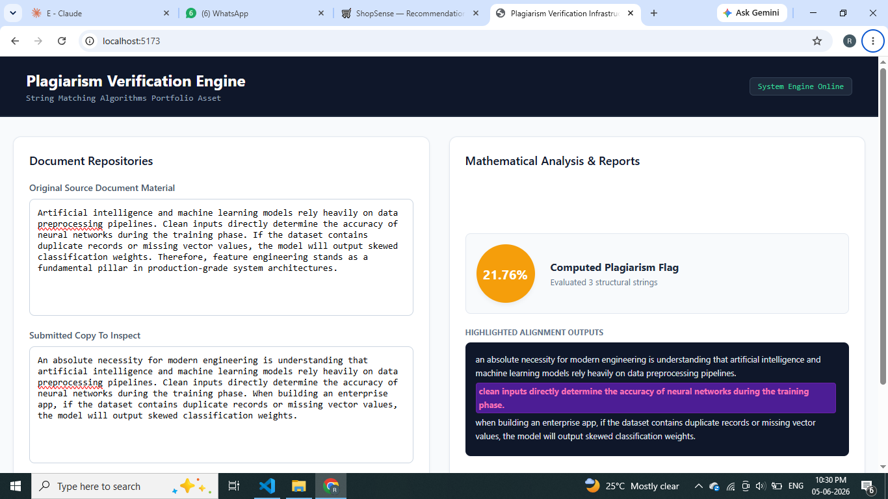
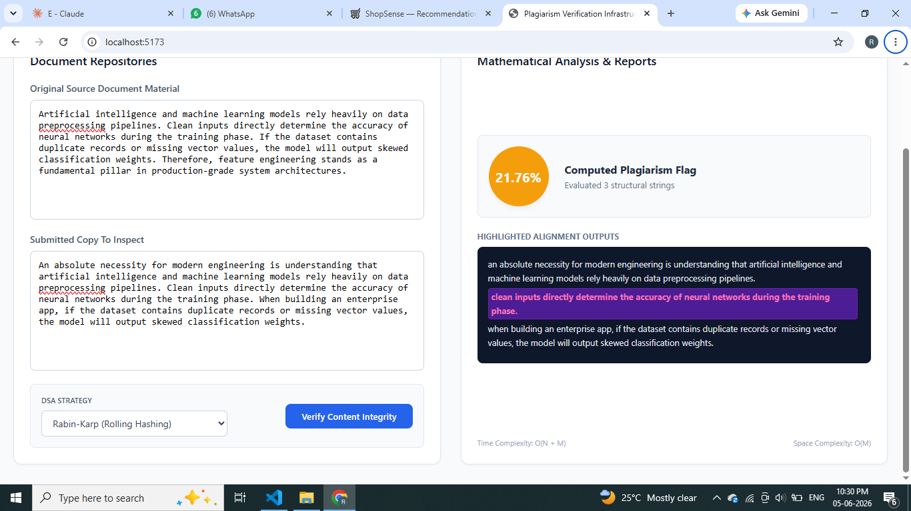

```markdown
# Plagiarism Verification Engine 🔍🖥️
### A Full-Stack String-Matching Algorithms Portfolio Asset

A high-performance, full-stack web application designed to evaluate document integrity and flag textual overlaps using classic Data Structures and Algorithms (DSA) paradigms. By decomposing multi-line text blocks into structural sentence elements, the engine executes exact pattern-matching sequences against a trusted reference source.

---

## 💡 Architecture & Design Philosophy
Unlike bloated enterprise web tools that rely on heavy, black-box third-party dependencies, this system was engineered from the ground up to showcase pure engineering fundamentals:
* **Backend Core:** Developed with clean, minimal Python API routes to handle sentence parsing, token clean-up, and real-time algorithmic execution.
* **Frontend UI:** Built using raw, native CSS styling elements and modular React JS component structures to achieve a modern, responsive split-pane analytics dashboard without the build-pipeline overhead of utility frameworks.

---

## 🛠️ Algorithmic Deep Dive & Complexity Analysis

The platform implements two classic text-processing strategies to track down patterns efficiently:

### 1. Knuth-Morris-Pratt (KMP) Algorithm
* **Approach:** Automata-based linear scanning. It preprocesses the search pattern to build a Partial Match / Longest Prefix Suffix (LPS) table. When a character mismatch occurs, the engine uses this table to skip redundant recalculations of previously validated characters.
* **Time Complexity:** $O(N + M)$ where $N$ is the length of the source document text and $M$ is the length of the pattern string.
* **Space Complexity:** $O(M)$ to allocate the auxiliary LPS tracking array.

### 2. Rabin-Karp Algorithm
* **Approach:** Rolling hash matching. It maps string configurations into polynomial numeric values. By updating the hash value of a sliding window in $O(1)$ constant time using modular arithmetic, it skips character-by-character validation unless a direct hash collision is detected.
* **Time Complexity:** $O(N + M)$ average case; $O(N \times M)$ worst-case scenario (mitigated by robust hash selection).
* **Space Complexity:** $O(1)$ auxiliary memory requirement.

---

## 📁 Repository Structure
```text
Plagiarism-Detector-String-Matching/
│
├── backend/                  # Python API Development Source
│   ├── app/
│   │   ├── main.py           # API Route Definitions & Parsing Engine
│   │   └── core_dsa.py       # Raw KMP & Rabin-Karp Algorithm Implementations
│   └── requirements.txt      # Backend Dependencies
│
└── frontend/                 # React JS Single Page Application Source
    ├── src/
    │   ├── components/       # Interface Sub-Layout Frameworks
    │   ├── App.jsx           # Main State Manager & Dashboard Component
    │   ├── index.css         # Pure Native CSS Layout Stylesheet
    │   └── main.jsx          # Vite React Project Bootstrapper
    ├── index.html            # Main SPA Document Entrypoint
    └── package.json          # Frontend Node Dependency Registry

```
## 🚀 Installation & Local Deployment

### Prerequisites

 * **Python 3.10+** installed locally.
 * **Node.js (v18+)** and **npm** installed locally.
 * 
### 1. Backend Server Initialization

Open a fresh terminal window, navigate to your backend directory, and install requirements:
```bash
cd backend
pip install -r requirements.txt

```
Launch the live development server:
```bash
uvicorn app.main:app --reload

```
The core backend processing environment will initialize live at http://127.0.0.1:8000.


### 2. Frontend Interface Initialization
Open a **second, separate terminal window** to host your client assets:
```bash
cd frontend
npm install

```
Spin up the local deployment development server:
```bash
npm run dev

```
Open your web browser and navigate directly to **http://localhost:5173** to access the live web-based engineering dashboard.

## 🖥️ Production Dashboard Features
 * **Dual Document Workspaces:** Structured side-by-side layout fields to feed original master references alongside submitted copies under evaluation.
 * **DSA Strategy Toggles:** Interactive selection dropdowns that allow developers to swap underlying execution configurations instantly between KMP and Rabin-Karp.
 * **Real-Time Analytics Metrics:** Displays clear, color-coded circular percentage badges indicating threat thresholds (Safe Green, Warning Yellow, Danger Red).
 * **Visual Match Alignment:** Injects custom CSS highlighter blocks over sections where exact substring plagiarism strings were flagged by the algorithms.
```

---
### Screenshots



---

### Demo Video
Link : https://drive.google.com/file/d/1ObK5dQphlH9aA9eGNHqtvomcCglmswqs/view?usp=sharing

---
**
### Author**

** Rakshitha A S**
